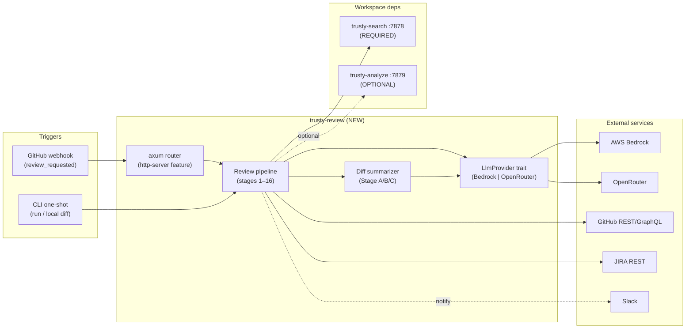
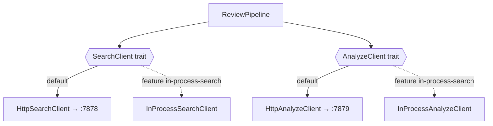
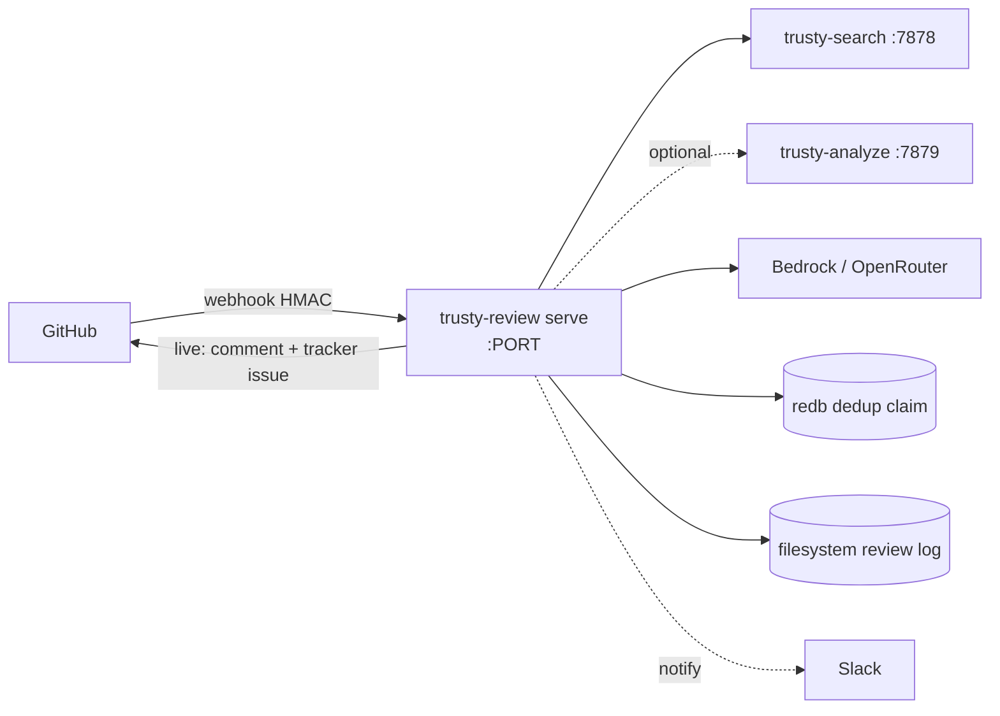
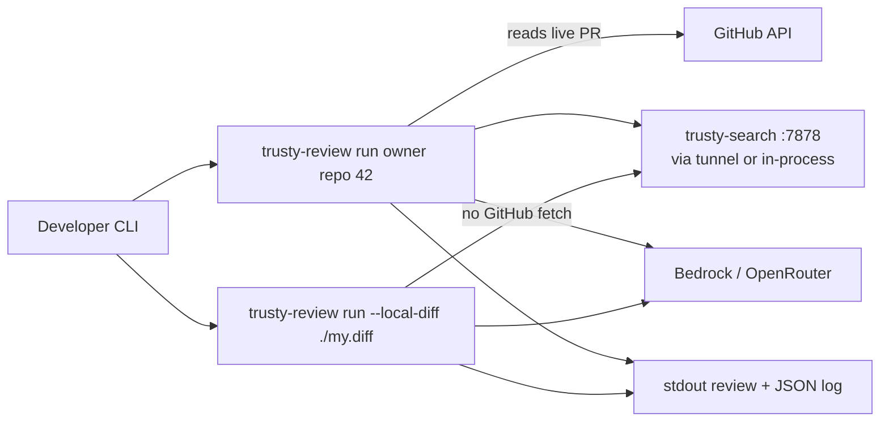

# 01 — Architecture

**Status:** DRAFT
**Part of:** [trusty-review spec](README.md)
**Cross-refs:** [02-pipeline](02-pr-review-pipeline.md) · [04-llm-providers](04-llm-providers.md) · [05-integrations](05-integrations.md) · [09-deployment](09-deployment-operations.md)
**Factual basis:** source-analysis §11 (workspace conventions), §6 (adapters), §13 (delta table).

---

## 1. System context

trusty-review is the third member of the `trusty-tools` PR-review triad. It orchestrates; it does not index or analyze on its own.



---

## 2. Crate layout within the workspace

**REV-001** — trusty-review SHALL be added as `crates/trusty-review/` and picked up automatically by the workspace glob `members = ["crates/*"]` (source-analysis §11.1). It SHALL NOT modify the workspace root manifest except to add shared dependencies under `[workspace.dependencies]`.

**REV-002** — The crate SHALL ship a library (`src/lib.rs`, `[lib] name = "trusty_review"`) and a binary (`src/main.rs`, `[[bin]] name = "trusty-review"`), mirroring trusty-analyze (source-analysis §11.1, §11.3).

**REV-003** — The crate SHALL set `edition = "2024"`, `rust-version = "1.88"` (workspace MSRV), matching the current workspace package settings. (NOTE: source-analysis §11.2 records edition 2021 as the old convention; the live workspace `[workspace.package]` is now edition 2024 — the implementer SHALL follow the live workspace value.)

**REV-004** — axum + tower-http SHALL be **optional** dependencies gated behind a `http-server` feature, defaulting on, exactly as trusty-analyze does (source-analysis §11.2). Library consumers building `--no-default-features` MUST be able to use the pipeline, diff summarizer, and provider trait without pulling the HTTP stack. The webhook server (`service` module) SHALL be compiled only under `http-server`.

**REV-005** — Errors in library modules SHALL use `thiserror` enums; the binary SHALL use `anyhow`. No `unwrap()` in library code (use `?` or `expect()` only for true invariants). No global state / no `lazy_static!`. Logs go to **stderr** only. (source-analysis §11.2)

**REV-006** — Every public item SHALL carry Why / What / Test doc comments; no source file SHALL exceed 500 lines (split proactively). (source-analysis §11.2)

### 2.1 Proposed module map (normative shape, not code)

```
crates/trusty-review/
├── Cargo.toml
└── src/
    ├── lib.rs                  # re-exports; crate-level docs
    ├── main.rs                 # binary: clap dispatch → CLI or `serve`
    ├── config/                 # global config + per-repo config model (doc 06)
    │   ├── mod.rs
    │   ├── global.rs           # env + file → ReviewConfig
    │   └── repo.rs             # .github/code-intelligence.yml model
    ├── pipeline/               # the review pipeline (doc 02)
    │   ├── mod.rs              # ReviewPipeline orchestrator
    │   ├── eligibility.rs
    │   ├── dedup.rs            # in-flight + persistent claim
    │   ├── context.rs          # parallel retrieval (search/jira/apex/xref)
    │   ├── verdict.rs          # grade extraction + normalization
    │   ├── verify.rs           # per-finding verification round
    │   └── suppression.rs      # suppression + relevance gate
    ├── diff/                   # diff summarizer (doc 03)
    │   ├── mod.rs              # DiffAnalyzer (Stage A/B/C)
    │   ├── file_filter.rs      # Stage A
    │   ├── hunk_filter.rs      # Stage B (deterministic)
    │   ├── hunk_classifier.rs  # Stage C (LLM)
    │   └── models.rs           # FilteredDiff et al.
    ├── llm/                    # provider abstraction (doc 04)
    │   ├── mod.rs              # LlmProvider trait + RoleModels
    │   ├── openrouter.rs       # wraps trusty_common::chat::OpenRouterProvider
    │   └── bedrock.rs          # Bedrock Converse provider
    ├── integrations/           # external clients (doc 05)
    │   ├── github/             # auth, PR ops, tracker issues, webhook verify
    │   ├── jira.rs
    │   ├── search_client.rs    # trusty-search HTTP client (:7878)
    │   ├── analyze_client.rs   # trusty-analyze HTTP client (:7879)
    │   └── slack.rs
    ├── store/                  # persistence (doc 07): dedup claims + review log
    │   ├── mod.rs
    │   ├── dedup.rs            # redb cross-process claim
    │   └── log.rs              # filesystem JSON/MD review log
    ├── service/                # axum webhook server (http-server feature, doc 08)
    │   └── mod.rs              # build_router(state) -> Router
    └── cli/                    # CLI subcommands (doc 08)
        └── mod.rs
```

Files approaching 500 lines (e.g. `pipeline/mod.rs`, `service/mod.rs`) SHALL be split further during implementation.

---

## 3. Consuming trusty-search and trusty-analyze: in-process vs HTTP

The product owner asked us to *prefer in-process library calls where the workspace allows, else HTTP, and recommend*.

### 3.1 Analysis

| Dependency | In-process feasible? | Notes |
|------------|----------------------|-------|
| **trusty-search** | Partially. `trusty-search` is a lib + binary; its types could be linked. **But** the production index lives in a *separately deployed* daemon (`:7878`) with its own redb store, embedder pool, and GPU/CPU lifecycle. The serving model is: one long-lived daemon, many clients. (source-analysis §6.1, CLAUDE.md architecture). |
| **trusty-analyze** | Partially. Same shape — already a daemon at `:7879`, already exposes `/review/github-pr` and `/webhooks/github` axum routes (verified in `crates/trusty-analyze/src/service/mod.rs`). |

### 3.2 Recommendation

**REV-007 (RECOMMENDED, NORMATIVE DEFAULT)** — trusty-review SHALL consume both trusty-search and trusty-analyze **over HTTP** (`:7878`, `:7879`) as its default and production transport, mirroring the Python adapters (source-analysis §6, §11.5). Rationale:

1. The daemons own a heavyweight, separately-managed runtime (embedder pool, GPU on the indexing instance, redb stores synced from S3). Linking them in-process would duplicate that lifecycle inside the review process and defeat the "restart the daemon without downtime" isolation property (CLAUDE.md "Why trusty-search is a separate process").
2. The Python production deployment already proved the HTTP boundary, including its graceful-degradation and readiness-probe semantics. Reusing the contract de-risks the port.
3. It keeps trusty-review a thin orchestrator, satisfying NG2.

**REV-008 (OPTIONAL EXTENSION)** — The crate MAY expose an `in-process-search` cargo feature that, when enabled, satisfies the same internal `SearchClient`/`AnalyzeClient` traits (REV-410, REV-430 in doc 05) by calling `trusty_search` / `trusty_analyze` library entry points directly — for the local-CLI single-binary use case where no daemon is running. The trait boundary (below) makes this swappable without touching the pipeline.

**REV-009** — All trusty-search/trusty-analyze access SHALL go through a Rust trait (`SearchClient`, `AnalyzeClient`) so the transport (HTTP vs in-process) is an implementation detail invisible to the pipeline. This is the same indirection the Python code achieved with its adapter classes (source-analysis §6).



---

## 4. Component responsibilities

| Component | Responsibility | Doc |
|-----------|----------------|-----|
| `service::build_router(state) -> Router` | axum 0.8 webhook + health/status surface; matches trusty-analyze pattern. | 08 |
| `cli` | `run`, `run --local-diff`, `list`, `stats`, `compare`, `eval`. | 08 |
| `ReviewPipeline` | Owns the 16-stage ordered pipeline; pure orchestration over the trait-boundary clients. | 02 |
| `DiffAnalyzer` | Stage A/B/C diff filtering; usable standalone. | 03 |
| `LlmProvider` impls | Bedrock + OpenRouter behind one trait; per-role model selection. | 04 |
| `integrations::*` | GitHub (App+PAT), JIRA, trusty-search/analyze clients, Slack. | 05 |
| `store` | dedup claim (redb) + review log (filesystem). | 07 |
| `config` | global (env+file) + per-repo YAML. | 06 |

---

## 5. Local vs server topology

**REV-010** — The same binary SHALL support both modes; mode is selected by subcommand, not a build flag (binding decision #4). `trusty-review serve` starts the webhook daemon; `trusty-review run …` performs a one-shot review and exits.

### 5.1 Server mode (production)



- Long-lived; multi-worker safe via the redb cross-process claim (REV-110, doc 02 / doc 07).
- Default `dry_run = true` (source-analysis §12.8). Only `review_requested` events dispatch (source-analysis §1.2, §12.4).

### 5.2 Local / one-shot mode (developer)



- `run` honors `dry_run` (defaults true → never posts). `--local-diff` reviews a diff file with no GitHub fetch and no posting (always dry).
- May target a tunneled production trusty-search (`make tunnel` analog) or an `in-process-search` build (REV-008).

---

## 6. Graceful-degradation posture (summary; detailed in doc 05/09)

**REV-011** — Required dependencies: **trusty-search** and the **selected LLM provider**. If either is unavailable, the review SHALL be skipped (not silently approved) and a Slack service-failure notification SHALL be sent. (source-analysis §9, §12.10)

**REV-012** — Optional dependency: **trusty-analyze**. If it is unavailable, the pipeline SHALL proceed with an empty static-analysis context. Its absence MUST NOT raise the "service unavailable" path. (source-analysis §12.10)

**REV-013** — Readiness for trusty-analyze SHALL be the **two-step cheap probe** (`GET /health` + `GET /indexes`), never the O(corpus) `/quality` endpoint. (source-analysis §12.3 — see doc 05 REV-431 and doc 10 §L3.)

**REV-014** — JIRA, Confluence, APEX, Slack, and suppression lookups are all **fail-open**: any error degrades to "no extra context" / "no suppression" and never blocks the review. (source-analysis §12.9)
