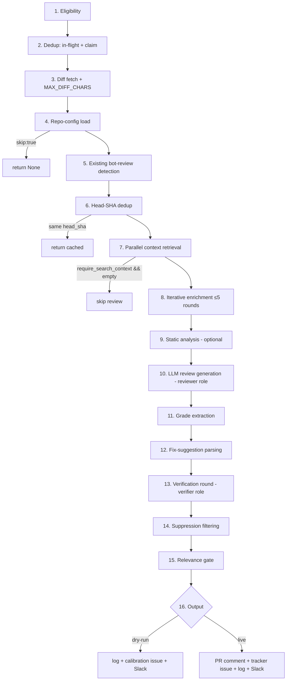

# 02 — PR Review Pipeline

**Status:** DRAFT
**Part of:** [trusty-review spec](README.md)
**Cross-refs:** [01-architecture](01-architecture.md) · [03-diff-summarizer](03-diff-summarizer.md) · [04-llm-providers](04-llm-providers.md) · [05-integrations](05-integrations.md) · [07-data-models](07-data-models.md) · [10-lessons](10-lessons-and-rationale.md)
**Factual basis:** source-analysis §1 (pipeline), §2 (verdict + verification), §5 (log/dedup), §12 (lessons).

This document specifies the core review pipeline: the ordered stages, the fail-safe verdict policy, and the per-finding verification round.

---

## 1. Pipeline stage sequence

The pipeline is a direct, ordered re-specification of the Python `review_pr → _review_pr_inner → _run_review_pipeline → _run_review_pipeline_inner` chain (source-analysis §1.3). It runs identically in server and CLI modes; the only differences are the *trigger* (doc 08) and the *output side-effects* (dry vs live).



### Stage-by-stage requirements

**REV-100 — Stage 1: Eligibility.** Check the repo against the enabled/excluded allow/deny lists (`PR_INTELLIGENCE_ENABLED_REPOS` / `EXCLUDED_REPOS`, doc 06). `*` = all; `org/*` = org wildcard; deny list always overrides allow list. Not enabled → return early, no LLM call. (source-analysis §1.3 step 1, §10.1)

**REV-101 — Stage 2: Deduplication (three layers).** (source-analysis §1.3 step 2, §5.3, §12.4)
- (a) In-process per-`(owner,repo,pr_number)` guard, claimed at request receipt **before** the head SHA is known.
- (b) In-process per-`(owner,repo,pr_number,head_sha)` guard once the SHA is known.
- (c) Cross-process atomic claim in the persistent store (redb; doc 07 REV-620) keyed on `(owner,repo,pr_number,head_sha)`. The claim SHALL be an atomic insert-or-fail; stale claims (> `DEDUP_STALE_SECS` = 7200) SHALL be purged on each claim attempt; the claim SHALL be released in a `finally`/`Drop`-equivalent guard to avoid leaks.
  > **Rationale (lesson learned §12.4):** Concurrent webhook delivery fires multiple events per push; all three layers are required, and the cross-process claim is critical for multi-worker server deployments.

**REV-102 — Stage 3: Diff fetch + truncation.** Fetch PR metadata, file list, and unified diff (doc 05 GitHub client). Collapse noisy fixture/i18n files to a 1-line summary (`NOISY_FILE_PATTERNS`, `NOISY_DIFF_MIN_LINES` = 30). Build the prompt diff text and **truncate to `MAX_DIFF_CHARS` = 16384** (≈ 4k tokens). Use the diff summarizer (doc 03) when available; fall back to raw truncated diff otherwise. (source-analysis §1.3 step 3, §3.4)

**REV-103 — Stage 4: Repo config load.** Fetch `.github/code-intelligence.yml` from the reviewed repo's default branch via the GitHub Contents API. On any error, fall back to the default config (**fail-open**). If `skip: true`, return immediately with no review. (source-analysis §1.3 step 4, §8, §12.9)

**REV-104 — Stage 5: Existing bot-review detection.** Fetch prior bot/Copilot PR reviews and classify a "copilot mode" ∈ {`full`, `supplement`, `duetto_only`} that conditions the reviewer prompt. (source-analysis §1.3 step 5)

**REV-105 — Stage 6: Head-SHA dedup (cache).** Look up any existing logged review for this PR. If its `head_sha` equals the current head SHA and `skip_dedup` is false, return the cached result without re-running. `eval` mode sets `skip_dedup = true`. (source-analysis §1.3 step 6, §1.1)

**REV-106 — Stage 7: Parallel context retrieval.** Run concurrently (source-analysis §1.3 step 7):
- **Code context** — trusty-search `POST /indexes/{index}/search`; query = PR title + changed file paths; up to `MAX_CONTEXT_FILES` = 6 chunks.
- **JIRA/ticket context** — doc 05 fallback chain.
- **APEX context** — queried as a repo within the same index (binding decision #3; doc 05 REV-420).
- **Confluence context**, **GitHub-issues context**.
- **Cross-reference blast-radius search** (REV-108).

  **REV-107 — require_search_context relevance gate (input side).** If `require_search_context = true` and code-context search returns **zero** results, the review SHALL be skipped entirely (no LLM call). (source-analysis §1.3 step 7)

**REV-108 — Cross-reference blast-radius search.** Extract enum constants (`ALL_CAPS_WITH_UNDERSCORE`) and method calls (`camelCase(`) from **deleted** diff lines; search trusty-search for *other, unchanged* files referencing them; prioritize producer-keyword hits (`enqueue`, `schedule`, `produce`, …).
  > **Rationale (lesson learned §12.13):** a PR that deletes a permission check leaves an orphaned producer in an untouched file; diff-only similarity never surfaces it.

**REV-109 — Stage 8: Iterative enrichment (≤ `MAX_ENRICHMENT_ROUNDS` = 5).** Extract identifiers (class/method/const names) from the diff; run targeted vector searches per identifier; add only newly-found chunks. Record `enrichment_rounds` and `enrichment_queries` for audit (doc 07). (source-analysis §1.3 step 8)

**REV-110 — Stage 9: Static analysis (optional).** Probe trusty-analyze readiness with the **two-step cheap probe** (REV-431); if ready, fetch complexity hotspots and smells for changed files; otherwise proceed with an empty analysis. Never raise on trusty-analyze failure. (source-analysis §1.3 step 9, §12.3, §12.10)

**REV-111 — Stage 10: LLM review generation (reviewer role).** Assemble all context into a structured prompt and call the **reviewer-role** provider (doc 04). The system prompt SHALL encode the fail-safe verdict policy (§2 below). Capture input/output token counts. Reviewer temperature default 0.3 (tighter than chat, for determinism). (source-analysis §1.3 step 10, §6.3)

**REV-112 — Stage 11: Grade extraction.** Scan the last 20% of the review body against the grade patterns; support both verdict tokens and letter grades A–F; normalize to one of `APPROVE` / `APPROVE*` / `REQUEST_CHANGES` / `BLOCK` / `N/A`. (source-analysis §2.1)

**REV-113 — Stage 12: Fix-suggestion parsing.** Parse structured ```fix_suggestions``` JSON blocks from the review body into `FixSuggestion` records (doc 07 REV-601). (source-analysis §1.3 step 12, §5.2)

**REV-114 — Stage 13: Verification round.** Per §3 below. (source-analysis §2.2)

**REV-115 — Stage 14: Suppression filtering.** Merge label-driven (`bot-suppress` closed issues) and repo-config (`suppress`) patterns; drop findings matching by case-insensitive substring OR ≥70% Jaccard word overlap; all lookups **fail-open**. (source-analysis §4.4, §8.2, §12.9; doc 05 REV-405, doc 06 REV-530)

**REV-116 — Stage 15: Relevance gate (output side).** (source-analysis §1.3 step 15)
- `min_findings` check — skip posting if surviving eligible findings < repo `min_findings` (or `PR_INTELLIGENCE_MIN_FINDINGS_TO_POST`).
- `suppress_advisory` check — if verdict ∈ {APPROVE, APPROVE\*} and there are no required-change findings, skip posting when `suppress_advisory` is set.

**REV-117 — Stage 16: Output.** (source-analysis §1.3 step 16)
- **Dry-run path:** write the review log (`review.json` + `review.md`), file/update a calibration GitHub issue (`code-intelligence-review` label), send Slack completion notice. Post nothing to the PR.
- **Live path:** post the PR review comment, upsert the single tracker issue for the PR, write the review log, send Slack completion notice.

**REV-118 — review_version.** Each result SHALL carry a `review_version` pipeline string (the Python baseline is `"v1.4"`). trusty-review SHALL stamp its own version (e.g. `"tr-0.1"`) so logs and tracker issues are attributable to a pipeline revision. (source-analysis §5.1)

---

## 2. Fail-safe verdict policy

**REV-130 — Default verdict is APPROVE; the bot bears the burden of proof.** The reviewer system prompt SHALL state this verbatim in intent. (source-analysis §2.1)

**REV-131 — REQUEST_CHANGES gate.** A `REQUEST_CHANGES` verdict SHALL require ALL THREE, evidenced from the **visible diff**: (a) a specific wrong line cited, (b) a traceable failure path, (c) a concrete fix. (source-analysis §2.1)

**REV-132 — BLOCK gate.** `BLOCK` is reserved for undisputed evidence of a serious flaw introduced by this PR (data loss, auth bypass, irreversible production breakage). (source-analysis §2.1)

### 2.1 Verdict taxonomy

| Verdict | Meaning | Findings precondition |
|---------|---------|------------------------|
| `APPROVE` | Merge as-is. | No findings, or only advisory. |
| `APPROVE*` | Merge, minor issues noted. | No surviving required-change findings. Also the **effective** outcome when all blocking findings are refuted (REV-141). |
| `REQUEST_CHANGES` | Must fix before merge. | ≥1 surviving finding meeting REV-131. |
| `BLOCK` | Serious undisputed flaw. | ≥1 surviving finding meeting REV-132. |
| `N/A` | Could not determine a grade. | Treated as APPROVE-tier for verification candidate selection (§3.1). |

**REV-133 — Letter-grade mapping.** When the reviewer emits a letter grade A–F instead of a verdict token, it SHALL be normalized: A/B → APPROVE-tier, C → APPROVE\*, D → REQUEST_CHANGES, F → BLOCK (implementer MAY refine the mapping but SHALL document it). A `display_grade` and `display_grade_is_fallback` flag SHALL be recorded (doc 07). (source-analysis §2.1, §5.1)

**REV-134 — Grade-divergence handling.** When the narrative verdict and the extracted grade diverge (e.g. narrative says "request changes" but the supporting finding's confidence is sub-threshold), the **verification round** (§3) is the arbiter. The reviewer's narrative is NOT trusted to set the final verdict on its own; surviving verified findings determine the effective outcome.
  > **Rationale (lesson learned §12.5):** the LLM wrote REQUEST_CHANGES while assigning the finding confidence < 0.90, so the finding was never verified and the verdict silently became APPROVE\*. Candidate selection (§3.1) is widened precisely to close this gap.

---

## 3. Per-finding verification round

Re-specifies Python `_verify_blocking_findings()` (source-analysis §2.2). Runs after fix-suggestion parsing (Stage 12), before suppression (Stage 14). Uses the **verifier role** provider (doc 04, Haiku-tier).

### 3.1 Candidate selection

**REV-135** — Candidate selection depends on the primary verdict (source-analysis §2.2 table; lesson §12.5):

| Primary verdict | Candidates sent to verifier |
|-----------------|------------------------------|
| `REQUEST_CHANGES` or `BLOCK` | ALL findings with `confidence ≥ VERIFY_CANDIDATE_MIN_CONFIDENCE` (0.50), sorted descending, capped at `FIX_ISSUE_MAX_PER_PR` (5). |
| `APPROVE`, `APPROVE*`, `N/A` | Only findings with `confidence ≥ block_threshold` (default 0.90). |

### 3.2 Per-finding decision

**REV-136** — For each candidate, call the verifier provider with the `VERIFICATION_SYSTEM_PROMPT`, which demands **exactly one word**: `CONFIRMED` if a specific wrong line is quotable and the failure path is traceable entirely within the visible code; `REFUTED` otherwise (absent evidence, requires assumptions outside the diff, or the diff appears truncated). (source-analysis §2.2)

| Verifier response | Action |
|-------------------|--------|
| `CONFIRMED` | Promote confidence to `max(current, block_threshold)`. |
| `REFUTED` | Set confidence to `FIX_ISSUE_MIN_CONFIDENCE - 0.01` (drops below both tiers). |
| Any error / exception | Same as REFUTED — **fail toward APPROVE**. |
| Truncation shortcut | Auto-REFUTE **without** an LLM call only when the diff is truncated AND **both** the finding's `file` AND its `line` marker are absent from the **full** diff text. |

**REV-137 — Verifier model must be ACTIVE.** The verifier provider/model SHALL default to a Bedrock foundation-lifecycle-`ACTIVE` Haiku-tier model (or its OpenRouter equivalent). Model-config errors (model-not-found, validation, access-denied, not-ready) SHALL be classified distinctly from transient network errors and emitted as a `verification_model_error` event at ERROR level with an alarm (doc 04 REV-340, doc 09 REV-810).
  > **Rationale (lesson learned §12.1):** a hardcoded LEGACY Haiku ID threw `ResourceNotFoundException` on every verification call → every finding auto-refuted → every PR silently became APPROVE. An inactive verifier model MUST produce an observable alarm, never a silent all-approve.

**REV-138 — Full-diff verification window.** The diff handed to the verifier (`diff_for_verify`) SHALL be the **full** `diff_text` already bounded to `MAX_DIFF_CHARS` by the caller — NOT a smaller sub-slice. The truncation shortcut (REV-136) SHALL test the full diff.
  > **Rationale (lesson learned §12.6):** checking only a 4k-char verification window auto-refuted real findings whose location appeared at char 4001–16384. Only genuinely hallucinated locations (absent from the full diff) may be auto-refuted.

### 3.3 Downgrade logic

**REV-139** — After verification, surviving blocking findings = candidates returned `CONFIRMED`. (source-analysis §2.2)

**REV-140** — If the primary verdict was `REQUEST_CHANGES`/`BLOCK` and NO blocking findings survive, the review body is **not** rewritten, but the filed-findings list is empty.

**REV-141** — With an empty filed-findings list, the **effective** outcome is `APPROVE*`. (source-analysis §2.2)

### 3.4 Confidence tiers

**REV-142** — (source-analysis §2.3)

| Tier / constant | Value | Behavior |
|-----------------|-------|----------|
| `FIX_ISSUE_MIN_CONFIDENCE` (advisory) | 0.70 | Summarized in the review comment. |
| `BLOCK_ISSUE_MIN_CONFIDENCE` (blocking) | 0.90 | Eligible to be filed as a tracker issue. |
| `VERIFY_CANDIDATE_MIN_CONFIDENCE` | 0.50 | Lower bound for verification candidacy when verdict is REQUEST_CHANGES/BLOCK. |
| `FIX_ISSUE_MAX_PER_PR` | 5 | Runaway safety cap on filed issues / verification candidates. |
| `FIX_ISSUE_ALLOWED_EFFORTS` | `("low","medium")` | Only these effort levels may file issues. |
| `issue_threshold` (repo) | 0.75 | Per-repo override of issue-filing threshold. |
| `block_threshold` (repo) | 0.90 | Per-repo override of BLOCK tier. |
| `pr_threshold` (repo) | 0.95 | High-confidence flag threshold. |

These constants SHALL be defined once (config/constants) and reused by both the pipeline and the diff summarizer (mirroring the Python shared-constant discipline that avoids drift; source-analysis §2.2 note on `HAIKU_MODEL_ID`).
