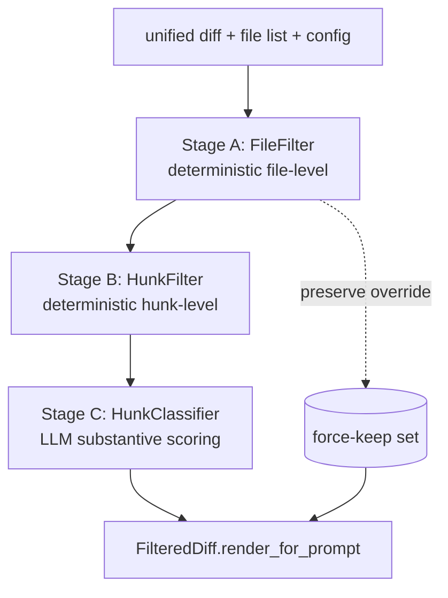

# 03 — Diff Summarizer (DiffAnalyzer)

**Status:** DRAFT
**Part of:** [trusty-review spec](README.md)
**Cross-refs:** [02-pipeline](02-pr-review-pipeline.md) · [04-llm-providers](04-llm-providers.md) · [07-data-models](07-data-models.md) · [10-lessons](10-lessons-and-rationale.md)
**Factual basis:** source-analysis §3 (DiffAnalyzer pipeline), §12.12 (noisy fixture problem).

This is the standalone specification for the diff summarizer/analyzer. It re-specifies the Python `services/diff_analyzer/` subpackage as the `crates/trusty-review/src/diff/` module. It is usable **independently** of the full review pipeline (REV-260).

---

## 1. Purpose

A PR diff is the LLM's single most expensive and most easily-poisoned input. The summarizer's job is to hand the reviewer a **token-budgeted, noise-stripped, anti-regression-protected** view of the diff while *never* dropping a security- or logic-relevant change.

> **Rationale (lesson learned §12.12):** PR #9545 buried a real code change under i18n/fixture churn; the bot spent its context budget on noise and missed the change. The summarizer exists to prevent that class of failure.

**REV-200** — The summarizer SHALL be a deterministic-first, LLM-last, three-stage pipeline. Stages A and B are pure/deterministic; only Stage C calls an LLM. (source-analysis §3.1)

---

## 2. Stage architecture

Re-specifies `DiffAnalyzer.analyze(files, diff_text, config)` (source-analysis §3.1).

### 2.1 Stage A — FileFilter (deterministic, file-level)

**REV-201** — Stage A SHALL classify each file into a `FileDisposition` ∈ {`KEPT`, `DROPPED`, `SUMMARY_ONLY`} using ordered rules (source-analysis §3.1):

1. **Preserve-first (highest priority, overrides all drops):**
   - Built-in preserve patterns: `security/`, `.env`, `secrets/`, config files.
   - Credential-filename substrings: `secret`, `token`, `password`, `key`, `dsn`, `credential`.
   - Content-level credential-URL regex match.
   - User `diff_filter.preserve_patterns` (doc 06).
2. **Drop:** lockfiles, snapshots, generated code, pure renames.
3. **Summary-only:** fixture/i18n files exceeding `fixture_summary_min_lines` (default 30) → collapsed to a `summary_line`.
4. Otherwise → `KEPT`.

**REV-202** — Preserve rules SHALL take precedence over every drop/summarize rule. A file matching a credential pattern is ALWAYS `KEPT` in full. (source-analysis §3.1)

### 2.2 Stage B — HunkFilter (deterministic, hunk-level)

**REV-203** — For each surviving (`KEPT`) file, Stage B SHALL drop hunks by regex/language rule, recording a `HunkDropReason` (source-analysis §3.1):

| Rule (config-gated) | Drop reason | Default gate |
|---------------------|-------------|--------------|
| Whitespace-only hunk | `WHITESPACE_ONLY` | `diff_filter.ignore_whitespace` = true |
| Import-only hunk (language-specific) | `IMPORT_ONLY` | `diff_filter.ignore_imports` = true |
| Comment-only hunk | `COMMENT_ONLY` | `diff_filter.ignore_comments` = true |

**REV-204** — Stage B SHALL be purely deterministic (no LLM). Disabling a gate (doc 06) SHALL keep the corresponding hunk class.

### 2.3 Stage C — HunkClassifier (LLM, per-hunk substantive scoring)

**REV-205** — Stage C SHALL batch surviving hunks (`BATCH_SIZE` = 10 per call) and call the **summarizer-role** provider (doc 04 — model selectable independently of reviewer/verifier) at **temperature 0.0**, requesting a JSON array of `{hunk_id, classification, confidence, reason}`. (source-analysis §3.1, §3.2)

**REV-206 — Classification taxonomy.** (source-analysis §3.2)

| Classification | Meaning | Droppable |
|----------------|---------|-----------|
| `substantive` | Logic, schema, API, security, control-flow change. | No |
| `mechanical` | Formatting, whitespace, import reorder, generated, getters/setters. | Yes, **only if** `confidence > DROP_CONFIDENCE_THRESHOLD` (0.7). |
| `uncertain` | Cannot determine without more context. | No (kept). |

**REV-207 — Credential force-preserve.** A hunk containing a credential URL SHALL be force-preserved even if classified `mechanical` with high confidence. (source-analysis §3.1)

**REV-208 — Fail-safe on classifier error.** ANY LLM error during a batch SHALL cause ALL hunks in that batch to be treated as `uncertain` (kept). The summarizer never drops a hunk because the classifier failed. (source-analysis §3.1)
  > **Rationale:** mirrors the pipeline's fail-toward-APPROVE posture — when uncertain, show the reviewer more, not less.

---

## 3. Output / rendering

**REV-209** — Output type is `FilteredDiff`. Its `render_for_prompt(max_chars)` SHALL emit the kept files/hunks bounded to `max_chars` (default 12000), and SHALL **NOT** emit a manifest header in the rendered prompt text.
  > **Rationale (source-analysis §3.1, forecasting#120):** a manifest header in the rendered diff caused a framing-effect regression. The manifest is telemetry-only.

**REV-210 — Manifest telemetry.** A separate `build_manifest_telemetry()`-equivalent SHALL produce the drop/keep manifest for logging/metrics only — never injected into the LLM prompt. (source-analysis §3.1)

---

## 4. Data models

Re-specifies `diff_analyzer/models.py` (source-analysis §3.3). Full field tables live in [doc 07 §3](07-data-models.md); summarized here for self-containment.

| Type | Key fields |
|------|------------|
| `FilteredDiff` | `files: Vec<FilteredFile>`, `dropped_files: Vec<DroppedFile>`, `drop_hunk_counts: Map<String,u32>`, `original_byte_size`, `filtered_byte_size`, `phase2_telemetry` |
| `FilteredFile` | `filename`, `status` (added/modified/renamed/removed), `disposition: FileDisposition`, `hunks: Vec<FilteredHunk>`, `dropped_hunks: Vec<DroppedHunk>`, `summary_line: Option<String>` |
| `FilteredHunk` | `header` (`@@` line), `lines: Vec<String>`, `substantive_confidence: f32`, `reason_kept: String` |
| `DroppedHunk` | `reason: HunkDropReason`, `lines_count`, `header` |
| `DroppedFile` | `path`, `reason` |
| `FileDisposition` (enum) | `KEPT` / `DROPPED` / `SUMMARY_ONLY` |
| `HunkDropReason` (enum) | `WHITESPACE_ONLY` / `IMPORT_ONLY` / `COMMENT_ONLY` / `MECHANICAL_HAIKU` |

---

## 5. Noisy-file collapse (pipeline-side, separate from Stages A–C)

**REV-211** — Independently of the A/B/C pipeline, the review pipeline's diff-fetch stage (doc 02 REV-102) SHALL collapse large fixture/i18n diffs to a 1-line summary using `NOISY_FILE_PATTERNS` when a file's diff exceeds `NOISY_DIFF_MIN_LINES` (30). Patterns (source-analysis §3.4): `.tsv`, `.csv`, `nls/**/*.{properties,json}`, `messages/**`, `labels/**`, `fixtures/**/*.{json,xml,sql}`, `test*fixtures*/**`, `__generated__/**`, `generated/**/*.{java,ts,js}`.

This is belt-and-suspenders with Stage A (which also summary-collapses fixtures) and protects the raw-diff fallback path when the summarizer is unavailable.

---

## 6. Standalone usage

**REV-260** — The `diff` module SHALL be usable without the review pipeline. Inputs: a unified diff string (+ optional file-status list) + a `DiffFilterConfig`. Output: a `FilteredDiff`. This enables:
- The CLI `run --local-diff <file>` flow (doc 08 REV-720) to filter a local diff with no GitHub/trusty-search dependency.
- Unit testing of Stages A/B in isolation with no LLM (Stage C mocked or skipped via a `classify: false` flag).

**REV-261** — Stage C SHALL accept an injected `summarizer` provider (`Box<dyn LlmProvider>` / role handle, doc 04). When no provider is supplied, the summarizer SHALL run Stages A and B only and mark all surviving hunks `uncertain` (kept) — a fully deterministic, LLM-free mode.

**REV-262** — The summarizer SHALL NOT read configuration from global state; all knobs (`fixture_summary_min_lines`, `ignore_*`, `preserve_patterns`, `suppress_patterns`, `DROP_CONFIDENCE_THRESHOLD`, `BATCH_SIZE`) are passed in via a `DiffFilterConfig` value (source-analysis §11.2 "no global state").
