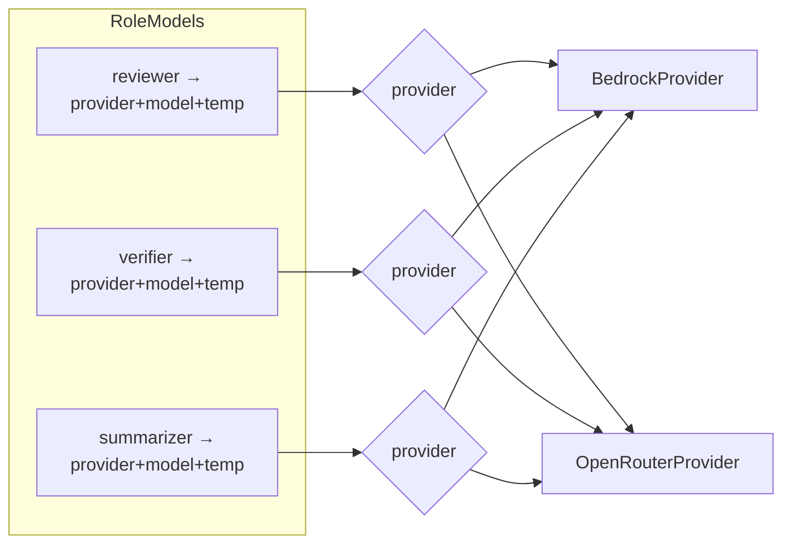

# 04 — LLM Providers

**Status:** DRAFT
**Part of:** [trusty-review spec](README.md)
**Cross-refs:** [02-pipeline](02-pr-review-pipeline.md) · [03-diff-summarizer](03-diff-summarizer.md) · [06-configuration](06-configuration.md) · [09-deployment](09-deployment-operations.md) · [10-lessons](10-lessons-and-rationale.md)
**Factual basis:** source-analysis §6.3 (Bedrock adapter), §11.4 (trusty-common chat client), §12.1 (inactive verifier), §12.2 (inference profile prefix), §13 (delta).
**Workspace grounding:** `crates/trusty-common/src/chat.rs` already defines a `ChatProvider` trait + `OpenRouterProvider` + `OllamaProvider` (verified).

This document specifies the pluggable LLM provider abstraction. **Binding decision #2:** co-equal Bedrock + OpenRouter behind one trait; models selectable **per run AND per role**.

---

## 1. Provider abstraction

**REV-300 — Single trait, two co-equal backends.** trusty-review SHALL define one `LlmProvider` trait with at least two concrete implementations — `BedrockProvider` and `OpenRouterProvider` — neither privileged. The provider in use is selected at **runtime** (env/config), not compile-time. (binding decision #2; source-analysis §11.4, §13)

**REV-301 — Reuse trusty-common.** The OpenRouter implementation SHALL reuse / wrap the existing `trusty_common::chat::OpenRouterProvider` (OpenAI-compatible `/v1/chat/completions`, `OPENROUTER_API_KEY`, default model `anthropic/claude-haiku-4.5`) rather than re-implementing the OpenRouter wire protocol. The Bedrock provider is net-new. (source-analysis §11.4)

**REV-302 — Trait shape (non-code sketch).** The trait SHALL expose a non-streaming, awaitable completion call sufficient for review/verify/summarize, returning text plus token usage. (The existing `trusty_common::chat::ChatProvider` is *streaming*; trusty-review MAY wrap it to accumulate a full response, or define its own `LlmProvider` that the OpenRouter impl satisfies by draining the stream.)

```text
trait LlmProvider (Send + Sync):
    async fn complete(req: LlmRequest) -> Result<LlmResponse, LlmError>
    fn name() -> &str            // "bedrock" | "openrouter"

LlmRequest:
    model: String               // resolved model ID for this call
    system: String
    messages: Vec<ChatMessage>
    temperature: f32
    max_tokens: u32

LlmResponse:
    text: String
    input_tokens: u32
    output_tokens: u32
    model: String               // echo of model actually used

LlmError (thiserror):
    ModelNotFound       // model/profile does not exist or is not ACTIVE  → ALARM
    ModelNotReady       // provisioning/lifecycle not ready                → ALARM
    Validation(String)  // malformed request (e.g. missing us. prefix)     → ALARM
    AccessDenied        // auth/permission                                  → ALARM
    Transport(String)   // DNS/connect/timeout — transient
    RateLimited
    Upstream { status, body }
```

**REV-303 — No global provider state.** Providers are constructed from config values and passed into the pipeline / summarizer as handles (`Box<dyn LlmProvider>` or `Arc<dyn LlmProvider>`); no `lazy_static!`/global singletons. (source-analysis §11.2)

---

## 2. Per-run AND per-role model selection

**REV-310 — Three roles.** The pipeline uses three LLM call-types, each independently model-selectable (binding decision #2):

| Role | Used by | Tier (today's baseline) | Temperature |
|------|---------|-------------------------|-------------|
| **reviewer** | Pipeline Stage 10 (doc 02 REV-111) | Sonnet-tier (`us.anthropic.claude-sonnet-4-6`) | 0.3 |
| **verifier** | Verification round (doc 02 REV-136) | Haiku-tier (ACTIVE) (`us.anthropic.claude-haiku-4-5-20251001-v1:0`) | 1.0 (single-word) |
| **summarizer** | Diff Stage C (doc 03 REV-205) | Haiku-tier | 0.0 |

**REV-311 — RoleModels config object.** A `RoleModels` value SHALL resolve, for each role: (provider backend, model ID, temperature, max_tokens). Each role MAY use a *different provider* (e.g. reviewer on Bedrock, summarizer on OpenRouter). (binding decision #2)

**REV-312 — Per-run override.** Every role's provider+model SHALL be overridable per run via CLI flags (doc 08: `--reviewer-model`, `--verifier-model`, `--summarizer-model`, `--provider`) and, for `eval`, by a list of reviewer models to compare. Run-level overrides take precedence over config-file and env defaults. (source-analysis §1.1 eval/compare; binding decision #2)

**REV-313 — Resolution precedence.** For each role: CLI flag → per-role env var → role default in config file → built-in default. (doc 06 REV-540)



---

## 3. Model IDs & Bedrock inference profiles

**REV-320 — Bedrock inference-profile prefix.** The `BedrockProvider` SHALL require model IDs that carry the cross-region inference-profile prefix `us.` (e.g. `us.anthropic.claude-sonnet-4-6`). On a config value lacking the prefix it SHALL either (a) reject at config-validation time with a clear error, or (b) be configured with an explicit `require_us_prefix = true` guard — implementer's choice, but the failure MUST be surfaced at startup, not at first review.
  > **Rationale (lesson learned §12.2):** bare model IDs (`anthropic.claude-3-5-sonnet-...`) fail Bedrock cross-region invocation with `ValidationException`/`ResourceNotFoundException`.

**REV-321 — Bedrock Converse API.** `BedrockProvider` SHALL use the Bedrock Converse API (`converse` / `converse_stream`) which normalizes request/response across model families. Region from `AWS_REGION` (doc 06). boto3-equivalent adaptive retry: `max_attempts = 3`, read timeout 120s. (source-analysis §6.3)

**REV-322 — OpenRouter model slugs.** `OpenRouterProvider` SHALL use OpenRouter model slugs (e.g. `anthropic/claude-haiku-4.5`, `anthropic/claude-sonnet-4.5`). OpenRouter does NOT need the `us.` prefix; the prefix rule (REV-320) is Bedrock-only. (source-analysis §12.2, §13)

**REV-323 — Model-ID config table.** Config SHALL accept, per role, a `{ provider, model }` pair so an operator can write e.g. `reviewer = { provider = "bedrock", model = "us.anthropic.claude-sonnet-4-6" }` or `reviewer = { provider = "openrouter", model = "anthropic/claude-sonnet-4.5" }`. (doc 06 §model-selection)

---

## 4. Token & cost tracking

**REV-330 — Usage capture.** Each `complete()` SHALL return `input_tokens` / `output_tokens`. The pipeline SHALL record final reviewer-call tokens on the result (`input_tokens`, `output_tokens`) plus a `cost_estimate_usd` (doc 07 REV-600). (source-analysis §5.1, §6.3)

**REV-331 — Multi-pass / per-role accounting.** When multiple LLM calls occur (summarizer batches, verifier per-finding, optional multi-pass), the implementation SHOULD aggregate per-role token totals for observability (analogous to Python `pass1_tokens`/`pass2_tokens`). (source-analysis §5.1)

**REV-332 — Metrics emission.** Token counts SHALL be emitted as metrics tagged by review type and role (Python emitted `LLMInputTokens`/`LLMOutputTokens` tagged `ReviewType=PRReview` to CloudWatch). Backend is deployment-specific (doc 09). (source-analysis §6.3)

---

## 5. Retry / timeout

**REV-333 — Timeouts.** Default per-call read timeout 120s (both providers). Connect timeout 10s (matches `trusty_common::chat` OpenRouter constants). (source-analysis §6.3, §11.4)

**REV-334 — Retries.** Transient errors (`Transport`, `RateLimited`, `Upstream 5xx`) SHALL be retried with bounded backoff (≤ 3 attempts). **Config/lifecycle errors (`ModelNotFound`, `ModelNotReady`, `Validation`, `AccessDenied`) SHALL NOT be retried** — they are deterministic and must alarm immediately. (source-analysis §12.1)

---

## 6. Active-model requirement & `verification_model_error` alarm

**REV-340 — Active-model requirement (BINDING).** The verifier model SHALL be a foundation-lifecycle-`ACTIVE` model. The provider SHALL classify model-config errors distinctly from transient failures (the `LlmError` variants in REV-302). When a *verification* call fails with a config/lifecycle error, the pipeline SHALL:
1. Emit a `verification_model_error` event at **ERROR** level with the model ID, provider, and error class.
2. Trigger the operational alarm (doc 09 REV-810).
3. Treat the finding as REFUTED for that call (fail toward APPROVE) — but the alarm guarantees the degradation is **observable**, never silent.

  > **Rationale (lesson learned §12.1):** the single most damaging production failure was a LEGACY verifier model ID that silently auto-refuted every finding, turning every review into APPROVE. This requirement makes that failure loud.

**REV-341 — Startup model probe (RECOMMENDED).** On server start and at the top of a CLI run, the binary SHOULD perform a cheap liveness/identity check of each configured role's provider+model (e.g. a tiny `complete()` or a provider list-models call) and refuse to start / warn loudly if a configured model is not ACTIVE/available. This converts §12.1 from a runtime surprise into a startup failure. (source-analysis §12.1; doc 09 REV-811)

---

## 7. Provider matrix (summary)

| Concern | BedrockProvider | OpenRouterProvider |
|---------|-----------------|--------------------|
| Auth | AWS creds / IAM role; `AWS_REGION` | `OPENROUTER_API_KEY` |
| Wire | Bedrock Converse API | OpenAI `/v1/chat/completions` (via `trusty_common::chat`) |
| Model ID form | `us.`-prefixed inference profile (REV-320) | OpenRouter slug (REV-322) |
| Reuse | net-new module | wraps `trusty_common::chat::OpenRouterProvider` |
| Primary deployment | production Duetto | local / standalone |
| Privilege | **co-equal** | **co-equal** |
