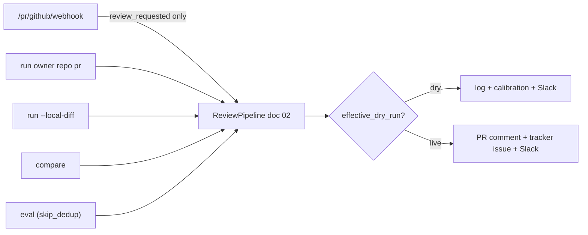

# 08 — Interfaces (HTTP API + CLI)

**Status:** DRAFT
**Part of:** [trusty-review spec](README.md)
**Cross-refs:** [01-architecture](01-architecture.md) · [02-pipeline](02-pr-review-pipeline.md) · [04-llm-providers](04-llm-providers.md) · [09-deployment](09-deployment-operations.md)
**Factual basis:** source-analysis §1.1–1.2 (entry points, webhook filtering), §11.3 (axum router pattern), §12.4/§12.8 (dedup, dry-run).
**Workspace grounding:** `crates/trusty-analyze/src/service/mod.rs` `build_router(state) -> Router` (axum 0.8); `core/github.rs::verify_webhook_signature` — reuse.

Two surfaces, one binary (doc 01 REV-010): a **webhook server** (`serve`) and a **CLI** (one-shot). Both drive the identical pipeline (doc 02).

---

## 1. HTTP API (server mode)

**REV-700 — axum router.** Under the `http-server` feature, `service::build_router(state) -> Router` SHALL expose the routes below, following the trusty-analyze pattern (source-analysis §11.3). The binary resolves config, builds state, and binds with `axum::serve()`.

| Route | Method | Purpose |
|-------|--------|---------|
| `/health` | GET | Liveness; reports version, dry-run flag, dependency reachability (trusty-search REQUIRED, trusty-analyze OPTIONAL), configured role models. |
| `/status` | GET | Richer status: in-flight review count, recent verdict distribution, last `verification_model_error` (if any). |
| `/pr/github/webhook` | POST | GitHub PR webhook; HMAC-validated; event-filtered. |

> The HTTP surface is intentionally minimal (NG3): trusty-review is a webhook consumer, not a general API. Search/chat/ontology endpoints are out of scope (those belong to the host app / trusty-search).

### 1.1 Webhook contract

**REV-701 — HMAC validation.** The webhook SHALL validate `X-Hub-Signature-256` against `GITHUB_WEBHOOK_SECRET` using a constant-time comparison (reuse `trusty_analyze::core::github::verify_webhook_signature` semantics). Invalid signature → 401, no dispatch. (source-analysis §1.2, §4.x; workspace grounding)

**REV-702 — Event filtering: only `review_requested` dispatches.** (source-analysis §1.2, §12.4, §12.8)

| `pull_request` action | Behavior |
|-----------------------|----------|
| `review_requested` | Classify trigger (REV-703) → dispatch pipeline. |
| `opened`, `synchronize`, `reopened` | 200 OK, **no dispatch**. |
| `closed` | 200 OK, short-circuit, no dispatch. |
| (other event types) | 200 OK, ignored. |

  > **Rationale (lesson learned §12.4, §12.8):** dispatching on every event caused duplicate reviews; restricting to `review_requested` is both a dedup layer and the dry-run rollout gate.

**REV-703 — Trigger classification** (from request context, not env; source-analysis §1.2):

| Condition | trigger | dry-run override |
|-----------|---------|------------------|
| `requested_reviewer.login == PR_REVIEW_BOT_USERNAME` | `manual` | `force_live = true` (posts live regardless of `PR_INTELLIGENCE_DRY_RUN`) |
| `requested_reviewer.login` ∈ `live_review_requesters` | `manual` | `force_live = true` |
| any other `review_requested` | `auto` | `force_dry_run = true` (files calibration issue) |

`effective_dry_run = (config.dry_run OR force_dry_run) AND NOT force_live` (doc 06 REV-541).

**REV-704 — Author exclusion.** PRs from logins in `PR_INTELLIGENCE_EXCLUDED_AUTHORS` SHALL be skipped before dispatch. (source-analysis §1.2)

**REV-705 — Async dispatch + ack.** The handler SHALL acknowledge the webhook quickly (200) and run the pipeline as a spawned task (`tokio::spawn`), matching the Python `asyncio.create_task` model. The in-process pre-SHA dedup guard (doc 02 REV-101a) SHALL be claimed before spawning. (source-analysis §1.2, §12.4)

**REV-706 — Health response shape (sketch).**

```json
{
  "status": "ok",
  "version": "tr-0.1",
  "dry_run": true,
  "deps": {
    "trusty_search": { "required": true, "reachable": true },
    "trusty_analyze": { "required": false, "reachable": false },
    "llm": { "provider": "bedrock", "reviewer_model_ok": true, "verifier_model_ok": true }
  }
}
```

`/health` SHALL return 200 when all REQUIRED deps are reachable; degraded (200 with a warning flag, or 503 — implementer's choice but documented) when a required dep is down. The verifier-model check ties to doc 04 REV-341.

---

## 2. CLI surface (local / one-shot mode)

**REV-710 — clap dispatch.** The binary SHALL use `clap` (workspace dep, derive + env) with these subcommands. All review subcommands honor `PR_INTELLIGENCE_DRY_RUN` unless `--live` is passed; `--local-diff` is always dry. (source-analysis §1.1)

| Subcommand | Purpose | Key flags |
|------------|---------|-----------|
| `serve` | Start the webhook daemon. | `--port`, `--config` |
| `run <owner> <repo> <pr>` | One-shot review of a live PR (honors dry-run). | `--no-context`, `--live`, `--multipass`, role-model flags |
| `run --local-diff <path>` | Review a local unified-diff file; no GitHub fetch, no posting (always dry). | role-model flags, `--repo-config <path>` |
| `list` | List logged reviews. | `--owner`, `--repo` |
| `stats` | Aggregate stats (verdict distribution, token totals, dedup skips). | `--since` |
| `show <owner> <repo> <pr>` | Show one logged review. | |
| `compare <owner> <repo> <pr>` | Full vs `--no-context` side-by-side (dry-run). | role-model flags |
| `eval <owner> <repo> <pr>` | Multi-model eval; `skip_dedup = true`. | `--models <slug,slug,...>` |

**REV-711 — `--no-context`.** Runs the pipeline with code/JIRA/APEX/analysis context retrieval disabled (LLM-only review). Sets `review_mode = "no_context"` on the result. (source-analysis §1.1, §5.1)

**REV-712 — `--multipass`.** Enables the optional two-pass pipeline; records `multipass`, `pass1_tokens`, `pass2_tokens` (doc 07). (source-analysis §1.1, §5.1)

**REV-713 — `eval` semantics.** `eval` SHALL set `skip_dedup = true` (so the same head SHA can be re-reviewed across models) and run the reviewer role once per model in `--models`, producing a comparison report. It is **dry-run only** — never posts. (source-analysis §1.1)

**REV-714 — `compare` semantics.** Runs the pipeline twice — full context and `--no-context` — and emits a side-by-side diff of verdicts/findings. Dry-run only. (source-analysis §1.1)

**REV-715 — Per-run model flags.** `--provider`, `--reviewer-model`, `--verifier-model`, `--summarizer-model` override config for that run (doc 04 REV-312, doc 06 REV-551). For Bedrock providers, the `us.` prefix is validated before the run starts (doc 04 REV-320).

**REV-720 — `--local-diff` independence.** `run --local-diff` SHALL function with NO GitHub credentials and NO live PR: it reads a diff file, runs the diff summarizer (doc 03 REV-260) + reviewer + verifier, and prints the review + writes a local JSON log. It MAY still query trusty-search for context if `TRUSTY_SEARCH_URL` is reachable; otherwise it degrades to `--no-context` behavior. This satisfies the "review a local diff" requirement in binding decision #4.

**REV-721 — Push firewall applies to all CLI paths.** No CLI flag can enable any write to a reviewed repo beyond posting a review comment / tracker issue in `--live` mode (doc 05 REV-403).

**REV-722 — Output.** CLI review commands print the review body + verdict to stdout and write the JSON/MD log (doc 07 REV-610). All diagnostic logging goes to **stderr** (source-analysis §11.2), keeping stdout clean for piping.

---

## 3. Interface ↔ pipeline mapping


